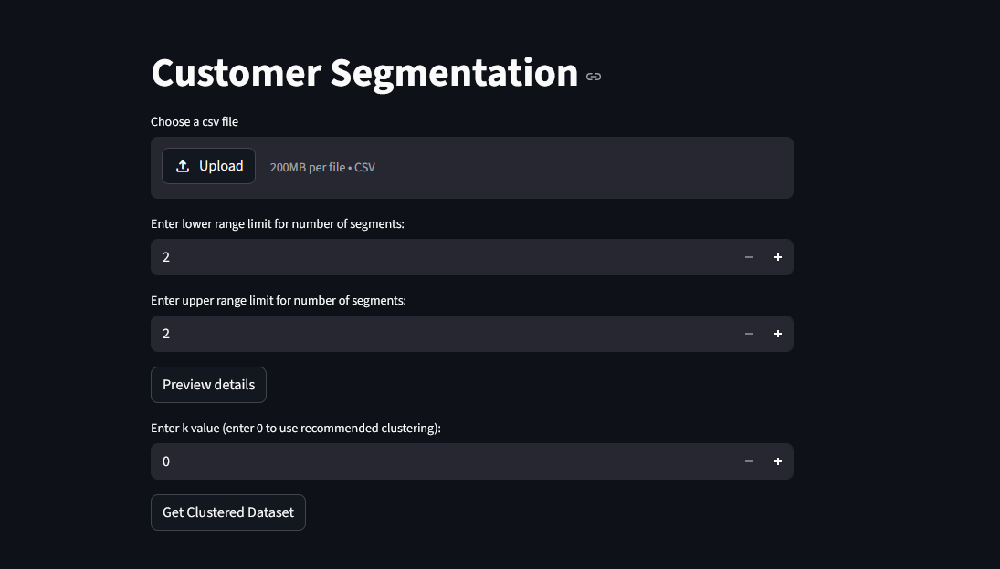
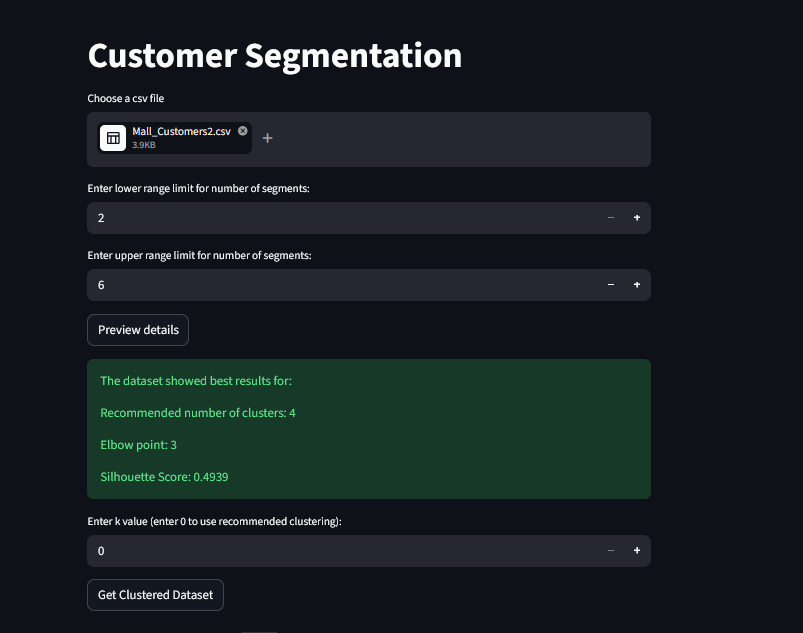
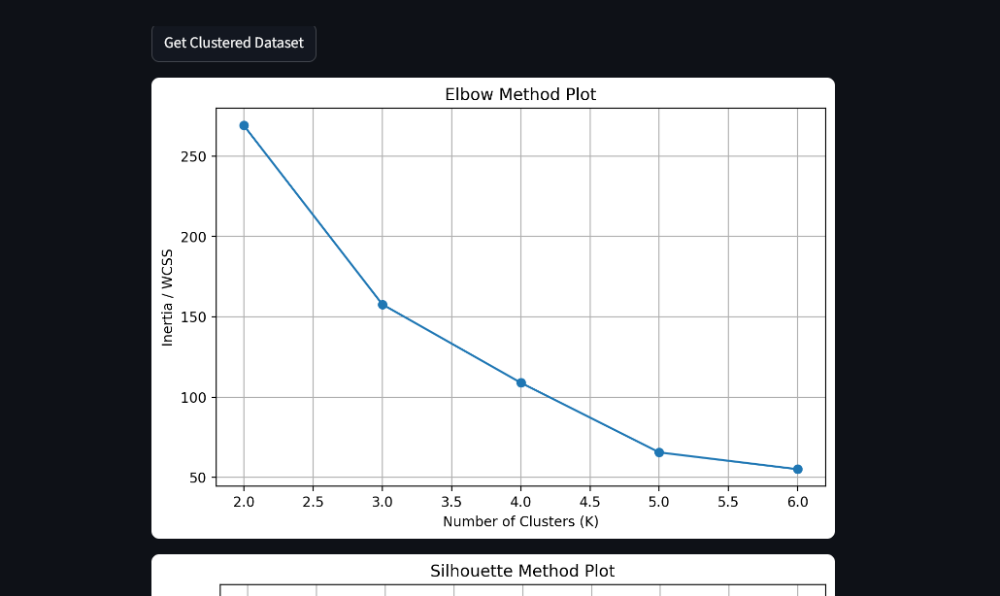
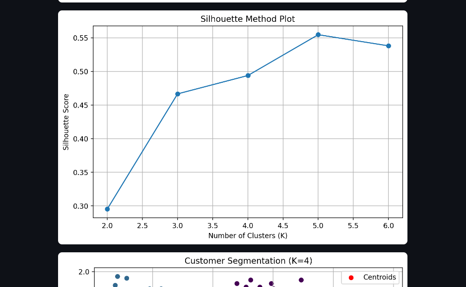
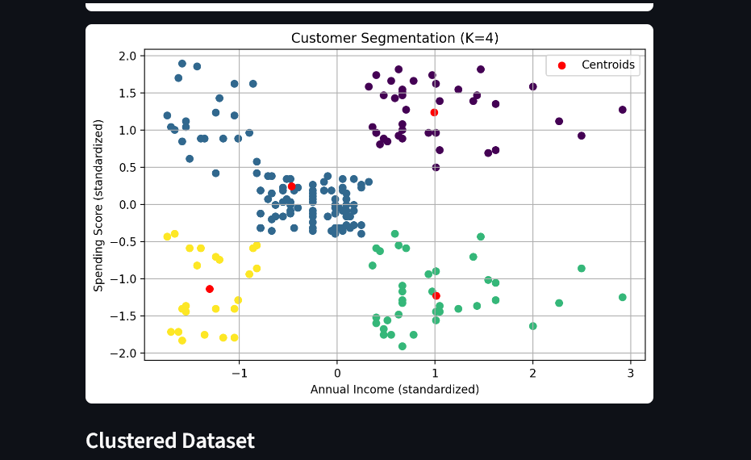
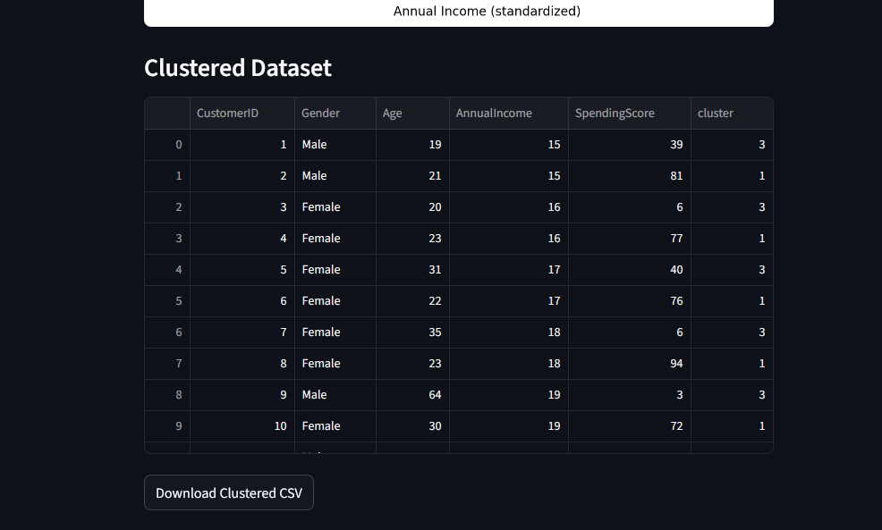
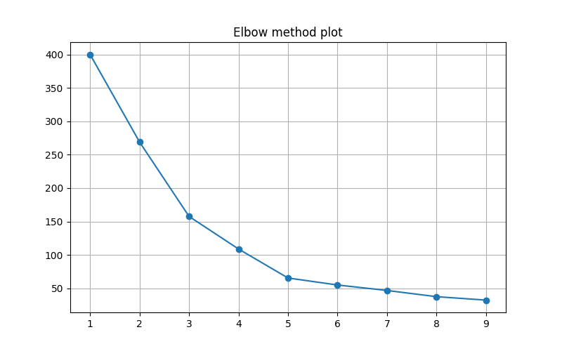
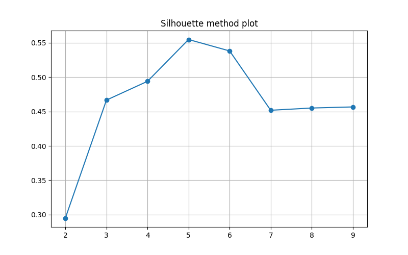
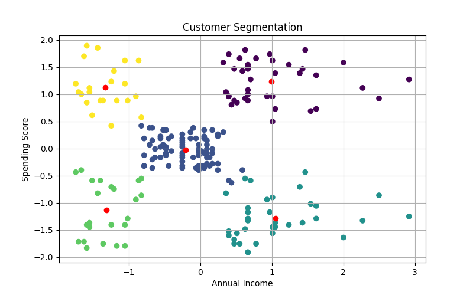

#Customer Segmentation

A machine learning model that takes csv file as the input and gives clustered data using KMeans under unsupervised learning. The csv dataset is expected to contain the columns `AnnualIncome` and `SpendingScore`

## Features

- Takes a csv file from the user
- Removes garbage data
- Feature selection
- Standardization using `standard scaler`
- Finds the elbow point using a elbow plot
- Finds the best value for `K` using both elbow point and silhouette score
- Displays the cluster plot
- Provides a downloadable clustered csv file
- Unsupervised learning
- Segmentation of dataset using `KMeans`
- `Streamlit` web application
- Groups a set of customers into `K` number of clusters


## Dataset (Atleast these two columns are required)
```
- AnnualIncome
- SpendingScore
```

## Data Preprocessing

The dataset was processed through following pipeline:

- Drops unwanted and null columns 
- Normalizes the datset using `Standard Scaler`
- Plots the elbow graph of the dataset
- Plots the silhouette score graph for different values of `K`
- Finds the best value for `K` using both elbow point and silhouette score
- Chooses the best possible value for `K`
- Displays the cluster plot


## Machine Learning Pipeline

- Take unprocessed dataset input from user
- Drop unwanted and null columns
- standardize(normalise) the data
- plot the elbow graph and the silhouette score graph
- Find the best possible value for `K`
- Ask user confirmation for the `K` value
- Segmenting(clustering) the dataset using KMeans
- Display the clustered data to the user
- Deployment of `streamlit` application


## Model Used

The final deployed model uses:

- **KMeans**


## Evaluation Metrics (V1)

- `Inertia`
- `Silhouette Score`
- `Elbow plot`


## Technologies Used

- `Python`
- `Pandas`
- `Scikit-learn`
- `Matplotlib`
- `Streamlit`
- `Joblib`


## Installation

```bash
git clone https://github.com/thirtesh/Customer-Segmentation.git

cd Customer-Segmentation

pip install -r requirements.txt

streamlit run app.py
```


## Challenges Faced

- Handling 2 streamlit buttons
- Allowing the user to select  the `K` value
- Finding the best `k` value


## Screenshots














## Evaluated Graphs








## Evolution of the project

-V1:
`Trained a KMeans model on a clean customer dataset. Used the saved, pretrained model to group future customers according to the predefined clusters`

-V2:
`Built a B2B-based automated ml pipeline that gets the csv file input from the user and clusters the customer data. Expects columns AnnualIncome and SpendingScore to be present in the dataset`


## Author

**Thirtesh P U**


