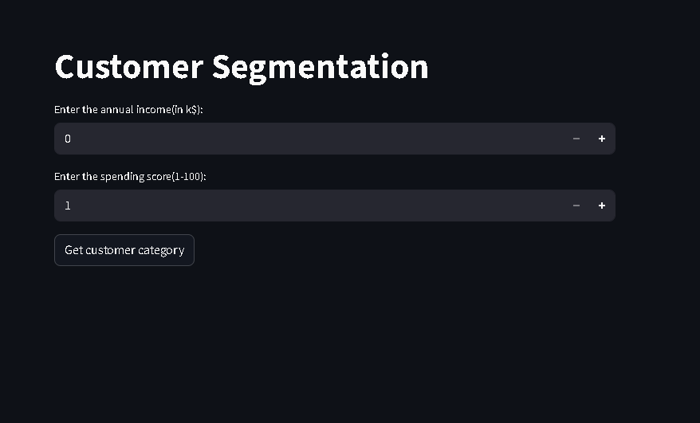
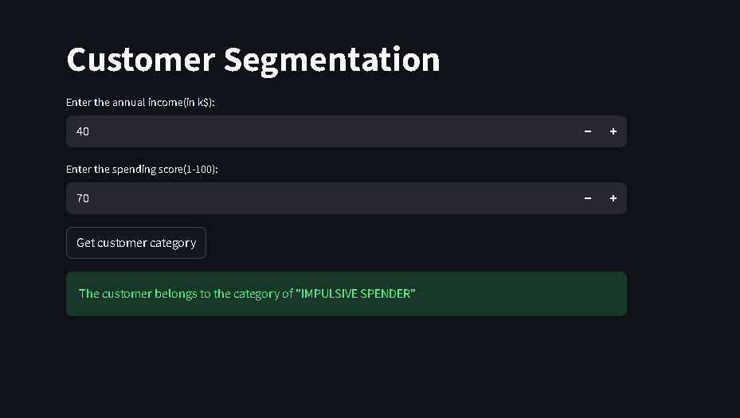

#Customer Segmentation

A machine learning model that is trained through unsupervised learning using KMeans to segment(cluster) and group customers into different categories(based on their income and spending)


## Features

- Handling garbage data
- Standardization using `standard scaler`
- Finding the elbow point using a elbow plot
- Finding the best value of silhouette score
- Unsupervised learning
- Segmentation of dataset using `KMeans`
- `Streamlit` web application
- Groups new customers using the trained model


## Dataset
```
- CustomerID
- Gender
- Age
- Annual Income(k$)
- Spending Score(1-100)
```

## Data Preprocessing

The dataset was processed through following pipeline:

- Renamed and droped unwanted columns
- Normalised the datset using `Standard Scaler`
- Ploted the elbow graph of the dataset
- Ploted the silhouette score graph for different values of `K`
- Chose the best possible value for `K`


## Machine Learning Pipeline

- Load unprocessed dataset
- rename columns and drop unwanted columns
- standardize(normalise) the data
- ploting the elbow graph and the silhouette score graph
- Finding the best possible value for `K`
- Segmenting(clustering) the dataset using KMeans
- Evaluating the cluster using relevant metrics
- Deployment of `streamlit` application


## Model Used

The final deployed model uses:

- **KMeans**


## Evaluation Metrics

- `Inertia`
- `Silhouette Score`
- `Elbow plot`


## Technologies Used

- `Python`
- `Pandas`
- `NumPy`
- `Scikit-learn`
- `Matplotlib`
- `Streamlit`
- `Joblib`


## Installation

```bash
git clone https://github.com/thirtesh/Customer-Segmentation.git

cd Customer-Segmentation

pip install -r requirements.txt

streamlit run app.py
```


## Challenges Faced

- Finding and cleaning a garbage-free dataset
- Finding the best `k` value within the constraints of business utility


## Screenshots






## Evaluated Graphs


## Author

**Thirtesh P U**


